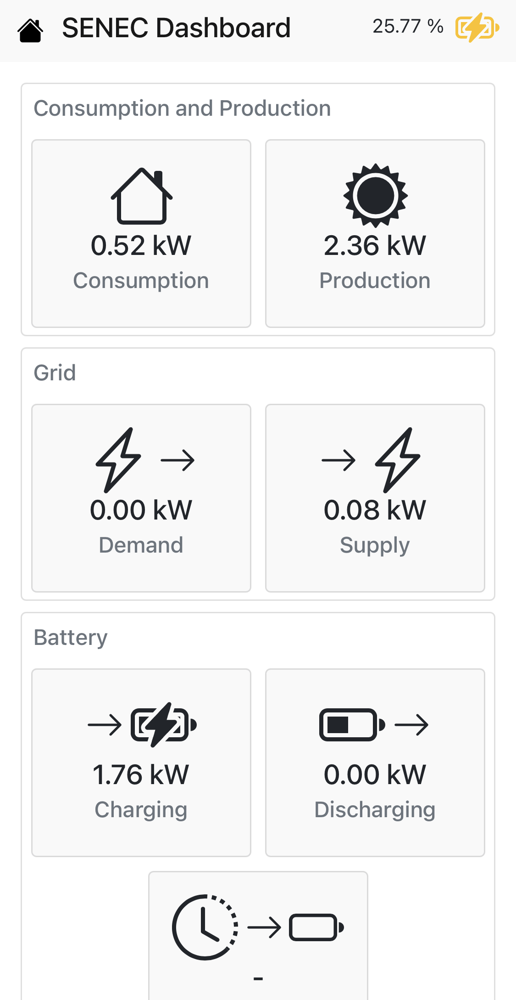

# Solar Wallbox
For the time being, this is a project to help me toggle my [go-eCharger](https://go-e.co/produkte/go-echarger-home/) wallbox based on excess power from my [SENEC.Home v3 Hybrid Duo](https://senec.com/de/produkte/senec-home-v3-hybrid) photovoltaic system.

Functionality to access the photovoltaic system and the wallbox is organized in plugins to make this as extensible as possible.

## Status
At the moment this is a working prototype without automation. However, I appreciate any feedback and hope this will also be useful for others :)

Plugins for the following devices are inclueded (as I need them in my personal scenario):

* [SENEC.Home v3 Hybrid Duo](https://senec.com/de/produkte/senec-home-v3-hybrid)
* [go-eCharger](https://go-e.co/produkte/go-echarger-home/)

## How to run it
Well, first create a config file `settings.json` in `src/config`. You can use the `sample_settings.json` that's already located there.

Then, you need `Python 3` and `pip` installed, to do:

    pip3 install -r requirements.txt
    cd src/
    python3 main.py

... or just use the `docker-compose.yml` that does everything for you:

    docker-compose up

## How does it look like

<table>
    <tr>
        <td>
            
        </td>
        <td>
            
        </td>
    </tr>
</table>
